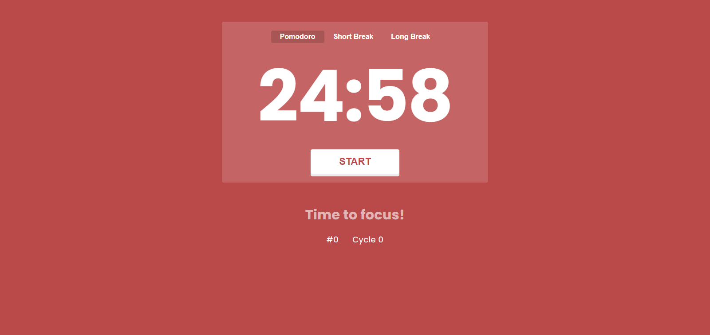

 

  

    
  

# 🍅 Pomodoro App - A simple pomodoro app to help you focus on your tasks. 🍅

  
  
  

---

  
  
  

 

## 📖 About

Pomodoro App is a clone from [pomofocus.io](https://pomofocus.io/) made by [@Yuya Uzu](https://uzu.works/). It's a simple app that helps you to focus on your tasks by using the [Pomodoro Technique](https://en.wikipedia.org/wiki/Pomodoro_Technique).

Besides being a clone, the incentive of this project was from [@Luiz Otávio](https://github.com/luizomf)'s course [JavaScript e TypeScript do básico ao avançado](https://www.udemy.com/course/curso-de-javascript-moderno-do-basico-ao-avancado/) (in portuguese).

## 💡 Features

-   **Responsive design** that works with desktop and mobile
-   **Color transition** to switch moods between work time and rest time
-   **Audio notification** at the end of a timer period

## 🚦 Getting Started

To get started with this app, follow these steps:

-   Clone or download the repository.
-   Install all dependencies with `npm install` or `yarn install`
-   Run the app with `npm start` or `yarn start`.

## 🤝 Contributing

If you'd like to contribute to this project, please follow these steps:

-   Fork the repository.
-   Create a new branch for your changes.
-   Make your changes.
-   Commit and push your changes to your new branch.
-   Submit a pull request for review.

## 📜 License

Copyright © 2023 [João Lucas](https://github.com/abacaxiguy). 
This project is licensed under the [MIT](https://github.com/abacaxiguy/pomodoro-app/blob/master/LICENSE) license.
